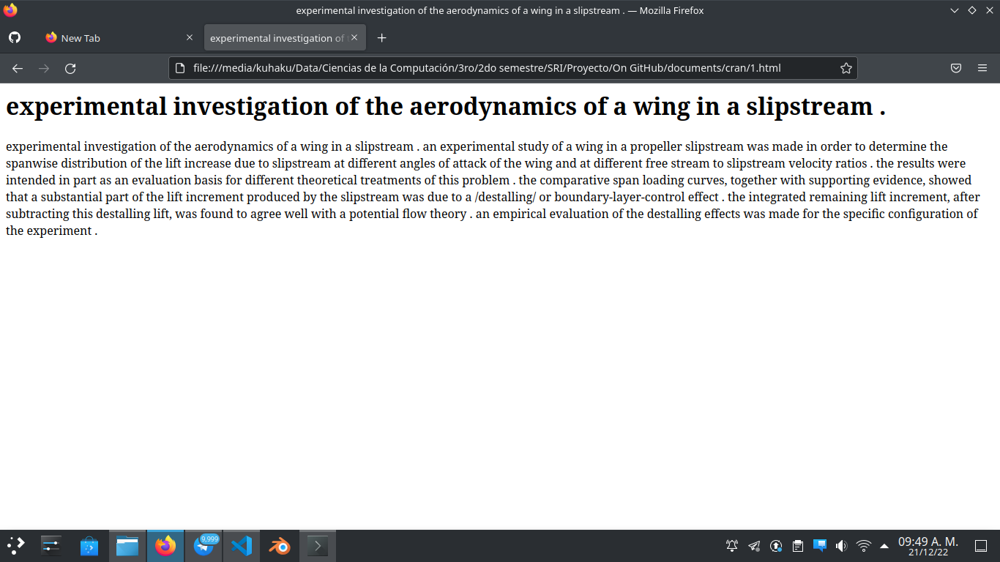

<<<<<<< HEAD
# Manual de usuario

Este repositorio es una aplicacion para recuperar informacion de una coleccion de documentos dada. Los modelos utilizados son Booleano, Vectorial e Indexacion por semantica latente. Consta de una aplicacion en python donde se corre el servidor y con una aplicacion frontend diseñada con HTML, CSS y JavaScript; estas aplicaciones se comunican a traves de una API, especificamente FastApi de python

## Requerimientos técnicos

Para el funcionamiento de la app es necesario tener un navegador web compatible con los estándares de los últimos años, Python 3.10 y el siguiente conjunto de dependencias.

```
FastApi
nltk
numpy
```
### Instalar dependencias

```
pip install -r requirements.txt
```
### Correr la aplicación 
#### Levantar el servidor:
* Abrir terminal (windows: cmd)
* Dirigirse a la carpeta Backend `cd Backend`
* Levante el servidor con el comando: `uvicorn API:app --reload`
* Debe indicarle al servidor la coleccion de documentos y el modelo de recuperacion que desee utilizar


#### Interfaz visual
  Una vez el servidor este levantado acceda a la carpeta Fronted y ejecute el archivo index.html.
* Abrir terminal (windows: cmd)
* `cd Backend`
* `index.html`
### Pantalla principal 
Despues de haber cargado las dos aplicaciones correctamente en el navegador se mostrara una pagina como se muestra en la imagen siguiente:


### Pantalla de resultados
Si hacemos una busqueda se mostrara en la misma pagina todos los resultados que la aplicacion de RIUL retorno como resultado de la query escrita por el usuario. Como se muestra en la siguiente imagen.


### Vista del documento
Una vez que se hace una búsqueda aparecen una serie de documentos , donde se puede dar clic y eso nos lleva a otra pagina donde se muestra el texto completo del documento que se quiere ver:



#### Estructura del proyecto
```
  |-Backend (folder)
  |-Fronted (folder)
  |-REARME.md
  |-requierments.txt
```

La carpeta `Backend` contiene la parte logica del proyecto, dentro de la carpeta `|-Backend\data` se ejecutan las queries, se crea todo lo necesario para el modelo y coleccion seleccionados, se parsean los documentos y agrupamos estos en la estructura trie. Se aplican tecnicas sobre documentos como es lematizacion.
dentro de la carpeta `|-Backend\api` se levanta la API de FastApi para poder hacer peticiones http desde el fronted.

La carpeta `Frontend` contiene los scripts de la parte visual interactiva del proyecto, como son los archicos `.js`, `.html` y `.css`, ademas cuenta con subcarpetas con imagenes y los assets necesarios para conformar la interfaz visual.
### Autores
1. [Raúl Beltrán](https://github.com/rb58853)
2. [Lidier Robaina](https://github.com/lido98)
3. [Victor Amador]()
=======
# RIUL
Retrieval Information System

Integrantes:
* Victor Amador
* Raúl Beltrán
* Lidier Robaina 

Modo de ejecución: Ejecutar desde consola en el directorio del proyecto el comando python \_\_main\_\_.py
>>>>>>> e9cf4341c90f38f9615f6e0b933bd45bac8597be
